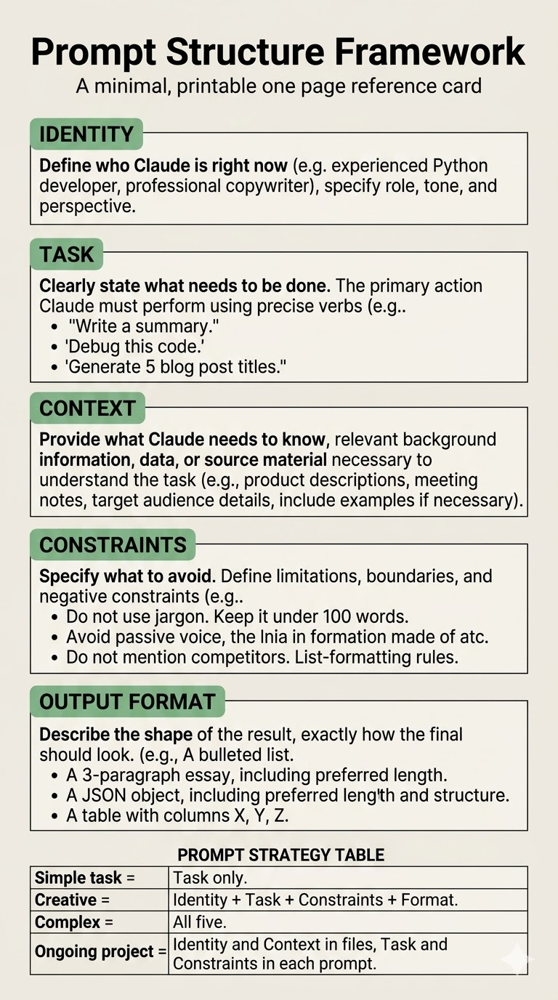

# 🧠 AI Skill Context & Prompt Writing Guide

## 🔍 How AI Processes Context

When working with Large Language Models (LLMs) like Claude or GPT, it is important to understand how they process input.

- AI tends to focus more on the **beginning (first tokens)** and **end (last tokens)** of a prompt.
- The **middle portion often receives less attention**, especially in long prompts.
- Question is how can we bring important things in LLM attention  at correct time

Large Language Models (LLMs) like GPT and Claude do not treat all parts of a prompt equally. They tend to focus more on the **beginning and end of the input**, while the middle content may receive less attention.

This creates a challenge:
> How do we ensure that the most important information is considered at the right time?

This project introduces a **Skill-Based Context System** to guide LLM attention more effectively.

---

## 🎯 Core Idea

Instead of sending one large, unstructured prompt, we:

- Break knowledge into **modular skill files**
- Provide only the **relevant context for the current task**
- Guide the model step-by-step using structured inputs

> Think of it as giving the AI the *right knowledge at the right moment*.

---

## 🧩 What Are Skills?

A **skill** is a structured unit of knowledge designed for a specific task.

Each skill file contains:
- Context (background information)
- Logic (rules, formulas, patterns)
- Constraints (what to avoid)
- Examples (optional but recommended)

---

## 📁 Example Folder Structure

### ✅ Practical Takeaways:
- Place **role and instructions at the beginning**
- Put **final task or instruction clearly at the end**
- Avoid hiding critical information in the middle
- Repeat key constraints if necessary

---

## 🧩 Rules to Write Effective AI Skills

### 1️⃣ Role (Identity)

Always start with defining **who the AI is**.

This includes:
- What the AI does
- How it approaches problems
- Its expertise and standards

### Example:
> You are a Python slot game developer who writes efficient, testable, and easy-to-debug code. You follow clean architecture and focus on RTP accuracy.

👉 Why this matters:
It sets expectations and improves output quality.

---

### 2️⃣ Task (Clear Instruction)

Clearly define **what needs to be done**.

A good task should include:
- A clear action (write, analyze, fix, compare, build, summarize)
- A defined scope (specific section, format, or size)
- Enough detail so even someone unfamiliar can attempt it

### Example:
> Analyze the RTP logic in the bonus game and identify discrepancies.

---

### 3️⃣ Context (Background Information)

Context provides the **necessary background** for accurate output.

Include:
- Project details
- Business logic
- Constraints
- Audience
- Relevant data or examples

### Example:
> We are a 15-person startup. Our customers are mid-market HR directors. We recently launched a feature that automates onboarding checklists. Here is the feature spec: [paste spec]

### Key Insight:
- More relevant context = Less guessing
- Less guessing = Better output

👉 If output feels generic, the issue is usually **missing context**, not a bad prompt.

### Best Practice:
- Provide examples
- Ask AI to **clarify if anything is ambiguous**

---

### 4️⃣ Constraints (What to Avoid)

Constraints define **what the AI should NOT do**.

AI has multiple possible paths — constraints help **prune incorrect ones**.

### Examples:
- Do not assume missing data
- Ask questions if anything is unclear
- Do not use paid APIs
- Keep language simple (8th-grade level)
- Avoid jargon
- Keep response under 300 words
- Write in paragraphs (no bullet points)
- Do not start with generic phrases like "In today's world"

### Why Constraints Matter:
Every constraint reduces errors and saves editing time.

👉 Think of past bad AI outputs — those are usually missing constraints.

---

### 5️⃣ Output Format (Structure of Response)

Always define **how the output should look**.

### Examples:
- A numbered list
- A markdown table
- Code blocks with comments
- Multiple options with explanations

### Example:
> Give three headline options (each under 10 words), followed by a one-line explanation.

### Another Example:
> Return a markdown table with columns: Task, Owner, Deadline, Status.

### Insight:
Output format determines whether the result is:
- ✅ Ready to use
- ❌ Needs reformatting

---

## 🧠 When to Use Which Parts

You don’t always need all five components.

| Task Type | Required Components |
|----------|-------------------|
| Simple (fix typo, rename) | Task only |
| Creative (write, design) | Role + Task + Constraints + Output |
| Complex (analysis, systems) | All five |
| Ongoing projects | Role + Context (in files), Task + Constraints (per prompt) |

---

## 🧩 Folder vs Prompt Concept

- **Folder = Memory**
  - Stores identity, project context, rules

- **Prompt = Direction**
  - Defines current task, constraints, output

👉 Together:
They create a powerful AI workflow.

---

## 🚀 Final Takeaways

- Always start with **role**
- Be clear and specific in **task**
- Provide rich and relevant **context**
- Use **constraints** to avoid bad outputs
- Define **output format** for usability
- Avoid long, unstructured prompts
- Ask:
  > “Is this clear enough for someone with zero context?”

---

## 💡 Golden Rule

> Better context beats better prompting.

---

